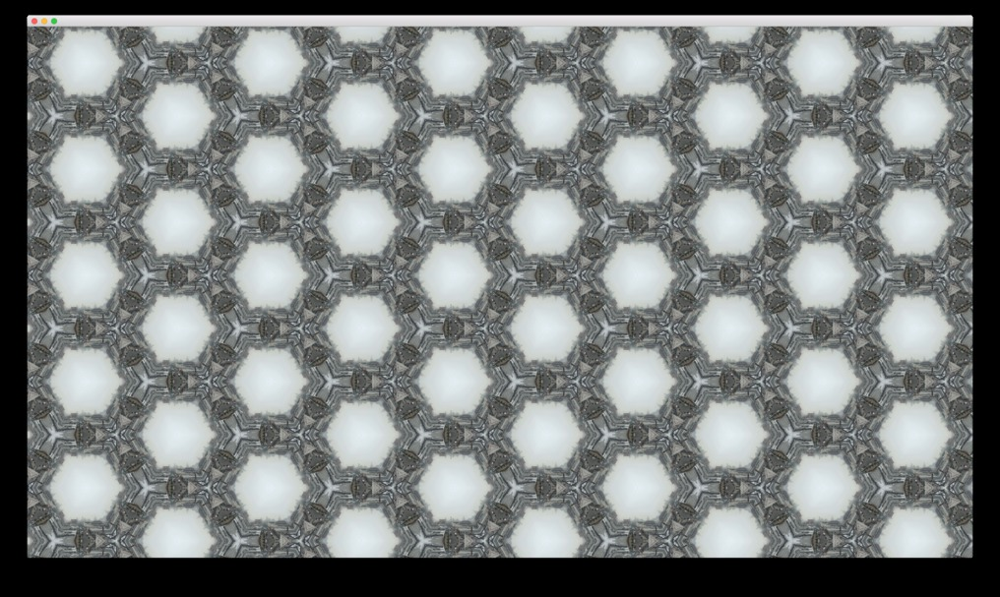

# Hexoscope

Openframeworks application that reads sequential images, arranges them in a hexagonal kaleidoscopic pattern and exports the generated frames to be included in a movie file.

Screenshot:

Final outputs:
http://cameronbrowning.com/content/95-seconds-of-gowanoscope/
